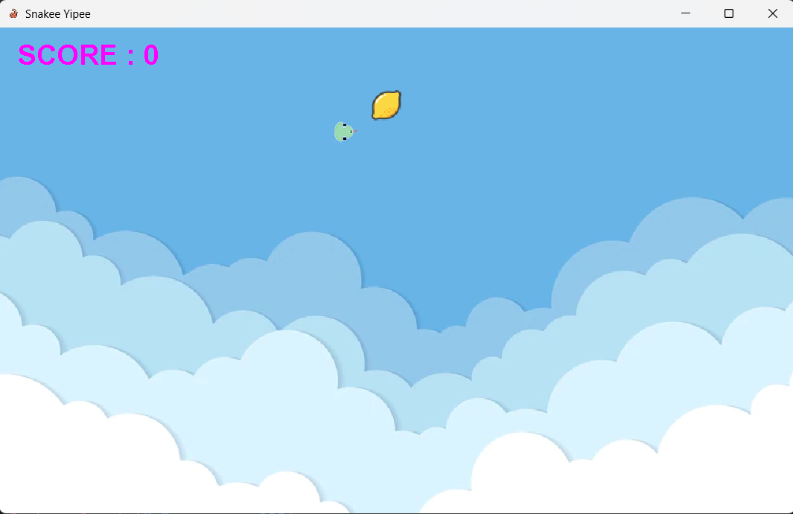

# Project Title: Snake Game
## Author: 
***Shuli WANG***

## Brief project description:
This project can enable users to play the classic snake game. The users can also customize the UI and the music, see the ranked high score list, and report the bugs in the game.


## How to install and run the project:

1. Clone the project to your computer:
```
git clone https://projects.cs.nott.ac.uk/scysw3/comp2013_cw.git
```

2. Open the project using your own java IDE (e.g. Intellij IDEA).

3. Run the Game class in the com.comp2013cw.snakegame package, then the game's home page will show up like this:

{:height="50%" width="50%"}

## How to play the game:
1. If you want to customize the UI and the background music of the game, click 'Customize' button in the home page, then confirm your choice.

2. Click 'Start' to start playing the snake game. When playing the game, if you want to pause it, click thepause icon in the upper right corner of the screen. You can also manually end the game by clicking 'End Game'. Your current score will on the upper left corner of the screen, next to the highest score. 

3. After the game ends, you will be asked to enter your name, please don't leave it blank or you'll receive a remind. 

4. After giving your name, the settlement screen will show up, which contains your name and your final score. If the score is the highest, you will be congratulated!

5. In the settlement screen, you can go back to the home page, or play the game again directly, or just exit the game.

6. You can go to the home page to see all the high scores anytime, it will be updated after each round of game, and be ranked from the highest to the lowest. You can also report a bug in the game or give suggestions by clicking 'Report Bug' in the home page.

## Credits:
The added images are either opensource or edited by myself.
The added music is paid to download and can be used.
