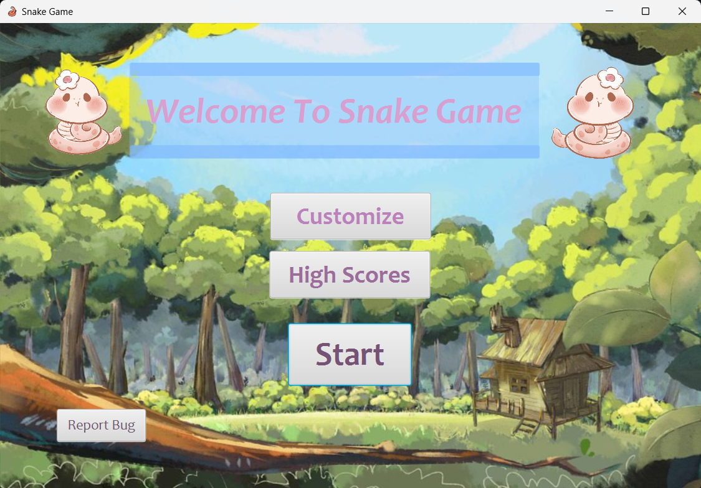

# COMP2013_CW


## How to deploy the project

1. Clone the project to your computer:
```
git clone https://projects.cs.nott.ac.uk/scysw3/comp2013_cw.git
```

2. Open the project using your own java IDE (e.g. Intellij IDEA).

3. Run the Play class in the IDE, then the game window will show up like this:


